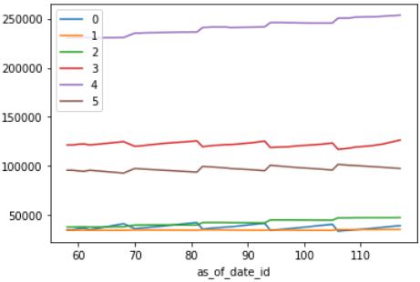
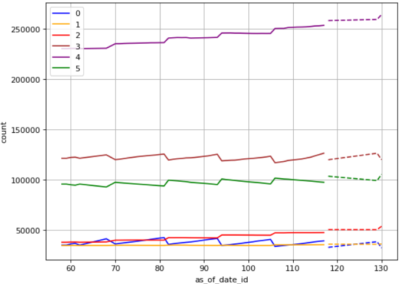

## Overview

This is a solution for the [Forecasting population of Vilnius](https://www.kaggle.com/competitions/forecasting-population-of-vilnius/data)
challenge. In this competition we were asked to predict Vilnius population for different age groups, sex groups, and districts.
Please, check the competition page for more details. 

## Download the data

To run the code locally, you'll need the competition dataset.
You can download it manually or use [kaggle api](https://www.kaggle.com/docs/api):

    kaggle competitions download -c forecasting-population-of-vilnius -p ./data
    unzip ./data/*.zip -d ./data/    

## Data visualization

Before running any algorithm, we analyzed the training data. In the graph below, you can see aggregated population vs date for each age id.
You can check `visualization.ipynb` file for the visualization script.  
We concluded, every time step correspond to a month and the jumps each year reflect that some people move from one age group to another.
We also see, that within the year (between jumps) the population is linear.
In the test dataset we have to predict population for 13 timestamp for all groups. That means we need to predict a jump in the 1st test timestamp `as_of_date_id=118`, a line for `as_of_date_id=119:129` , and a final jump for `as_of_date_id=130`.

## Model 

You can check `synthetic_with_fixed_steps.py` for more details regarding the implementation.

## Results

The graphs below show the aggregated predicted values ('--') vs date for each age group as well as train count (plain).

